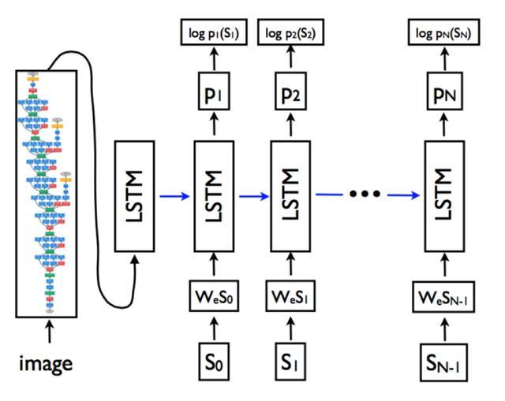
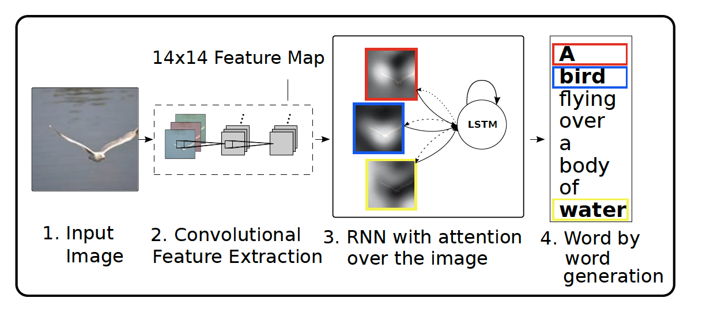

# Computer Vision - Image

## Classification
1. - [x] Krizhevsky, Alex, et al. "**Imagenet classification with deep convolutional neural networks**." Advances in neural information processing systems. 2012. [[pdf]](http://papers.nips.cc/paper/4824-imagenet-classification-with-deep-convolutional-neural-networks) (**AlexNet**) 

1. - [x] Zeiler, Matthew D., and R. Fergus. "**Visualizing and Understanding Convolutional Networks**." 	arXiv:1311.2901 (2013). [[pdf]](https://arxiv.org/abs/1311.2901) (**ZFNet**) 

1. - [x] Simonyan, Karen, and Andrew Zisserman. "**Very deep convolutional networks for large-scale image recognition**." arXiv preprint arXiv:1409.1556 (2014). [[pdf]](https://arxiv.org/pdf/1409.1556) (**VGGNet**)

1. - [x] Szegedy, Christian, et al. "**Going deeper with convolutions**." ICCV(2015). [[pdf]](https://arxiv.org/abs/1409.4842) (**GoogLeNet/Inception**) 

1. - [x] Szegedy, Christian, et al. "**Batch Normalization: Accelerating Deep Network Training by Reducing Internal Covariate Shift**." (2015). [[pdf]](https://arxiv.org/abs/1502.03167) (**InceptionV2/Batch Normalization**) 

1. - [x] Christian Szegedy, Vincent Vanhoucke, et al. "**Rethinking the Inception Architecture for Computer Vision**." (2015). [[pdf]](https://arxiv.org/abs/1512.00567) (**InceptionV3**) 

1. - [x] Srivastava, Rupesh Kumar, K. Greff, and J. Schmidhuber. "**Highway Networks**." Computer Science (2015). [[pdf]](https://arxiv.org/abs/1505.00387) (**Highway Networks**) 

1. - [x] Christian Szegedy, Vincent Vanhoucke, et al. "**Inception-v4, Inception-ResNet and the Impact of Residual Connections on Learning**." (2016). [[pdf]](https://arxiv.org/abs/1602.07261) (**InceptionV4**) 

1. - [x] He, Kaiming, et al. "**Deep residual learning for image recognition**." arXiv preprint arXiv:1512.03385 (2015). [[pdf]](https://arxiv.org/pdf/1512.03385) (**ResNet**)

1. - [x] Huang, Gao, et al. "**Densely Connected Convolutional Networks**." CVPR(2017). [[pdf]](https://arxiv.org/pdf/1608.06993) (**DenseNet**)

1. - [x] Yunpeng Chen, Jianan Li, Huaxin Xiao, Xiaojie Jin, Shuicheng Yan, Jiashi Feng et al. "**Dual Path Networks**." CVPR(2017). [[pdf]](https://arxiv.org/abs/1707.01629) (**DPN**)

## Detection
[[awesome-object-detection]](https://github.com/amusi/awesome-object-detection)
### 2D
#### Two Stage
1. - [x] Girshick, Ross, et al. "**Rich feature hierarchies for accurate object detection and semantic segmentation**." CVPR(2014). [[pdf]](http://www.cv-foundation.org/openaccess/content_cvpr_2014/papers/Girshick_Rich_Feature_Hierarchies_2014_CVPR_paper) (**RCNN**) 

1. - [x] He, K., et al. "**Spatial Pyramid Pooling in Deep Convolutional Networks for Visual Recognition**." IEEE Transactions on Pattern Analysis & Machine Intelligence. (2014). [[pdf]](https://arxiv.org/abs/1406.4729) (**SPPNet**) 

1. - [x] Girshick, Ross. "**Fast r-cnn**." CVPR(2015). [[pdf]](https://pdfs.semanticscholar.org/8f67/64a59f0d17081f2a2a9d06f4ed1cdea1a0ad) (**Fast RCNN**) 

1. - [x] Ren, Shaoqing, et al. "**Faster R-CNN: Towards real-time object detection with region proposal networks**." Advances in neural information processing systems. 2015. [[pdf]](https://arxiv.org/pdf/1506.01497.pdf) (**Faster RCNN**)

1. - [x] Sean Bell, C. Lawrence Zitnick, Kavita Bala, Ross Girshick, et al. "**Inside-Outside Net: Detecting Objects in Context with Skip Pooling and Recurrent Neural Networks**." CVPR (2016). [[pdf]](https://arxiv.org/abs/1512.04143)(**ION**)

1. - [x] Tao Kong, Anbang Yao, Yurong Chen, et al. "**HyperNet: Towards Accurate Region Proposal Generation and Joint Object Detection**." CVPR (2016). [[pdf]](https://arxiv.org/abs/1604.00600)(**HyperNet**)

1. - [x] Hong, Sanghoon, et al. "**PVANet: Lightweight Deep Neural Networks for Real-time Object Detection**." arXiv:1611.08588 (2016). [[pdf]](https://arxiv.org/abs/1611.08588)(**PVANet**)

1. - [ ] Dai, Jifeng, et al. "**R-FCN: Object Detection via Region-based Fully Convolutional Networks**." arXiv preprint arXiv:1605.06409 (2016). [[pdf]](https://arxiv.org/abs/1605.06409) (**R-FCN**)

1. - [x] Lin, Tsung Yi, et al. "**Feature Pyramid Networks for Object Detection**." CVPR(2016). [[pdf]](https://arxiv.org/abs/1612.03144) (**FPN**)

1. - [x] Lin, Tsung Yi, et al. "**Focal Loss for Dense Object Detection**." ICCV(2017). [[pdf]](https://arxiv.org/abs/1708.02002) (**Focal Loss**)

1. - [ ] Zeming Li, Chao Peng, Gang Yu, Xiangyu Zhang, Yangdong Deng, Jian Sun. "**Light-Head R-CNN: In Defense of Two-Stage Object Detector**." arxiv (2017). [[pdf]](https://arxiv.org/abs/1711.07264)(**Light-Head R-CNN**)

1. - [x] Robert J. Wang, Xiang Li, Shuang Ao, Charles X. Ling. "**Pelee: A Real-Time Object Detection System on Mobile Devices**." ICLR (2018). [[pdf]](https://arxiv.org/abs/1804.06882)(**PeleeNet**)

1. - [ ] Xizhou Zhu, Jifeng Dai, Xingchi Zhu, Yichen Wei, Lu Yuan. "**Towards High Performance Video Object Detection for Mobiles**." . [[pdf]](https://arxiv.org/abs/1804.05830)

1. - [ ] Borui Jiang, Ruixuan Luo, Jiayuan Mao, Tete Xiao, Yuning Jiang. "**Acquisition of Localization Confidence for Accurate Object Detection**." ECCV(2018) [[pdf]](https://arxiv.org/abs/1807.11590)[[github]](https://github.com/vacancy/PreciseRoIPooling)(**IOUNet**)

#### One stage
1. - [x] Liu, Wei, et al. "**SSD: Single Shot MultiBox Detector**." arXiv preprint arXiv:1512.02325 (2015). [[pdf]](http://arxiv.org/pdf/1512.02325)(**SSD**)

1. - [x] Zhiqiang Shen, Zhuang Liu, Jianguo Li, Yu-Gang Jiang, Yurong Chen, Xiangyang Xue. "**DSOD: Learning Deeply Supervised Object Detectors from Scratch**." ICCV(2017). [[pdf]](https://arxiv.org/abs/1708.01241v1)[[github]](https://github.com/szq0214/DSOD) (**DSOD**)

1. - [x] Tao Kong, Fuchun Sun, Anbang Yao, Huaping Liu, Ming Lu, Yurong Chen. "**RON: Reverse Connection with Objectness Prior Networks for Object Detection**." CVPR (2017). [[pdf]](https://arxiv.org/abs/1707.01691)[[github]](https://github.com/taokong/RON) (**RON**)

1. - [ ] Cheng-Yang Fu, Wei Liu, Ananth Ranga, Ambrish Tyagi, Alexander C. Berg. "**DSSD : Deconvolutional Single Shot Detector**." (2017). [[pdf]](https://arxiv.org/abs/1701.06659)(**DSSD**)

1. - [x] Shifeng Zhang, Longyin Wen, Xiao Bian, Zhen Lei, Stan Z. Li. "**Single-Shot Refinement Neural Network for Object Detection**." arxiv (2017). [[pdf]](https://arxiv.org/abs/1711.06897)[[github]](https://github.com/sfzhang15/RefineDet) (**RefineDet**)

1. - [x] Songtao Liu, Di Huang, Yunhong Wang. "**Receptive Field Block Net for Accurate and Fast Object Detection**." arxiv (2017). [[pdf]](https://arxiv.org/abs/1711.07767)[[github]](https://github.com/ruinmessi/RFBNet) (**RFBNet**)

1. - [ ] Redmon, Joseph, et al. "**You only look once: Unified, real-time object detection**." arXiv preprint arXiv:1506.02640 (2015). [[pdf]](http://homes.cs.washington.edu/~ali/papers/YOLO) (**YOLO**)

1. - [ ] Zuoxin Li, Fuqiang Zhou. "**FSSD: Feature Fusion Single Shot Multibox Detector**." arxiv (2017). [[pdf]](https://arxiv.org/abs/1712.00960v2)(**FSSD**)

**Review**
1. - [x] Huang, Jonathan, et al. "**Speed/accuracy trade-offs for modern convolutional object detectors**." (2016). [[pdf]](https://arxiv.org/abs/1611.10012) 

### 3D 
1. - [ ] Chen, Xiaozhi, et al. "**Monocular 3D Object Detection for Autonomous Driving, 2016:2147-2156.**." CVPR(2016). [[pdf]](https://www.cv-foundation.org/openaccess/content_cvpr_2016/papers/Chen_Monocular_3D_Object_CVPR_2016_paper.pdf) 

## Segmentation
[[awesome-semantic-segmentation]](https://github.com/mrgloom/awesome-semantic-segmentation)
### Segmantic
1. - [x] Long, Jonathan, E. Shelhamer, and T. Darrell. "**Fully convolutional networks for semantic segmentation**." EEE Conference on Computer Vision and Pattern Recognition IEEE Computer Society(2015). [[pdf]](https://arxiv.org/abs/1411.4038v2) (**FCN**)

1. - [x]  Hengshuang Zhao, Jianping Shi, Xiaojuan Qi, Xiaogang, et al. "**Pyramid Scene Parsing Network**." CVPR (2017). [[pdf]](https://arxiv.org/abs/1612.01105) (**PSPNet**)

1. - [x] Dvornik, Nikita, et al. "**BlitzNet: A Real-Time Deep Network for Scene Understanding**." ICCV (2017). [[pdf]](https://arxiv.org/abs/1708.02813) (**BlitzNet**)

1. - [ ] Xiaoxiao Li, Ziwei Liu, et al. "**Not All Pixels Are Equal: Difficulty-aware Semantic Segmentation via Deep Layer Cascade**." arXiv preprint (2017). [[pdf]](https://arxiv.org/abs/1704.08545) (**DLC**)

1. - [ ] He, Gkioxari, et al. "**ICNet for Real-Time Semantic Segmentation on High-Resolution Images**." arXiv preprint (2017). [[pdf]](https://arxiv.org/abs/1704.08545) (**ICNet**)

### Instance
1. - [ ] He, Gkioxari, et al. "**Mask R-CNN**." ICCV(2017). [[pdf]](https://arxiv.org/abs/1703.06870) (**Mask RCNN**)

## Caption
1. - [ ] Kyunghyun Cho, Bart van Merrienboer, Caglar Gulcehre, Dzmitry Bahdanau, Fethi Bougares, Holger Schwenk, Yoshua Bengio. "**Explain Images with Multimodal Recurrent Neural Networks**." arxiv (2014). [[pdf]](https://arxiv.org/abs/1406.1078) (**Encoder-Decoder**)

1. - [x] Oriol Vinyals, Alexander Toshev, Samy Bengio, Dumitru Erhan. "**Show and Tell: A Neural Image Caption Generator**." arxiv (2014). [[pdf]](https://arxiv.org/abs/1411.4555) (**NIC**)

     Image Caption的神经网络学习可以用数学公式概括为:
     ​							 $$\theta^* = arg\, \max_{\theta} \sum_{I,S}logp(S|I,\theta)  $$

      其中I为图片，S为生成的句子，θ为网络需要学习的参数，这个公式的含义指的是：学习最佳的网络参数θ最大化在给定图片下其生成正确描述的概率。同时由于语言句子的长度是不定长的，所以一般将其概率用链式法则写成：

     ​						$$ log  P(S|I)= \sum_{t=0}^Nlogp(S_t|I,S_{0},...,S_{t-1})$$

     

     * 训练：其目标是更新LSTM，CNN和词嵌入模型W的参数。

      									$$ x_{-1} = CNN(I)$$

      									$$x_t=W_e*S_t$$

      									$$p_{t+1}=LSTM(x_t)$$

      图像I只在t = -1时输入一次，以通知LSTM图像内容。经验证实，在每个时间步将图像馈送作为额外输入产生较差的结果，因为网络可以明确地利用图像中的噪声。在LSTM后会接一个softmax，分类的数量等于语料库里的词汇量。训练过程有如下几个问题需要注意：

     ​       （1）训练有两个阶段：第一阶段只训练word embedding和LSTM，第二阶段再联合CNN一起训练；  

     ​       （2）训练集中每次词保证不少于5次；

     * 测试：先用encoder进行图像的encoding，接着把image vec输入到LSTM中，这时有两种语言生成模式：

        （1）选择LSTM输出概率最大的那个，直到预测end为止；

        （2）beam search：迭代地考虑直到时间t的k个最佳句子的集合作为生成大小为t + 1的句子的候选者，并且仅保留它们的结果最好的k。

      * 训练与预测的矛盾：训练时，除LSTM的第一步外，每一步输入都是正确label的单词，而预测时，输入的是前一步预测的词，也就是说预测和训练时不统一的。

        （1）beam search可以起到一定的改善效果；

        （2）训练初期，为了加快收敛，使用正确的label；后期逐渐加大预测单词作为输入的比例，以达到在模型训练结束时，训练过程和预测过程接近。

        （3）值得注意的是，一直使用模型自身预测的结果作为输入效果会很差。

1. - [x] Kelvin Xu, Jimmy Ba, Ryan Kiros, Aaron Courville, Ruslan Salakhutdinov, Richard Zemel, Yoshua Bengio. "**Show, Attend and Tell: Neural Image Caption Generation with Visual Attention**." arxiv (2015). [[pdf]](https://arxiv.org/abs/1502.03044v1) (**ShowAttTell**)

     * Show and tell 在进行句子中问题预测时，没有考虑图片中相应的位置，接受的事上一层输入的词和上一层隐藏层的输出：

       ​							$$ h_{t+1}=f(h_t,x_t)$$

       h_t是前一步隐藏层的输出，x_t是前一个预测的词，而image vec=CNN(1)只是在第一步输入给LSTM。实际上，在生成不同的词时，所应“关注”的信息是不一样的。attention机制就是为了实现**不同时刻关注当前所“应该”关注的显著（salient）信息**这一目的，手段就是**对输入信息的各个局部赋予权重**。

       

     * attention机制就是在预测时，加上这一步单词所对应图片中的位置。

     ​							$$ h_{t+1}=f(h_t,x_t,z_t)$$

     ​	通过attention机制计算出的 z_t 被称为 context vector，是捕捉了特定区域视觉信息的上下文向量。那么，在attention中就有两个比较关键的量，一个是和时刻 t 相关，对应于解码时刻；另一个是输入序列的区域 a_i，对应图像的一个区域。

     ​							$$e_{ti} = f_{att}(a_i,h_{t-1})$$

     ​							$$a_{ti}=\frac{exp(e_{ti})}{\sum_{k=1}^L(exp(e_{tk}))}$$

     ​	式中的f_att就是耦合区域 a_i 和时刻 t 两个信息的函数，文中使用MLP，而a_ti就是权重。

     * attention 有两种方式：

     ​	(1) soft-attention：在 soft attention 机制中，权重 a_t,i 所扮演的角色是图像区域 a_i在时刻 t 的输入decoder的信息中的所占的比例。既然这样，就将各区域 a_i 与对应的权重 a_t,i 做加权求和就可以得到 z_t ：

     ​						$$ z_t = \sum_i a_i a_{t,i}$$

     ​	(2) hard-attention：在 hard attention 机制中，权重 a_t,i 所扮演的角色是图像区域 a_i 在时刻 t 被选中作为输入decoder的信息的概率，有且仅有一个区域会被选中。为此，引入变量 s_t,i ，当区域 i 被选中时取值为 1 ，否则为 0 。那么z_t如下：

     ​							$$ z_t = \sum_i S_{t,i}a_{i}$$